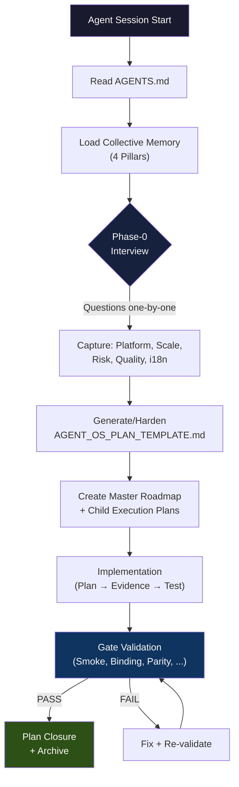
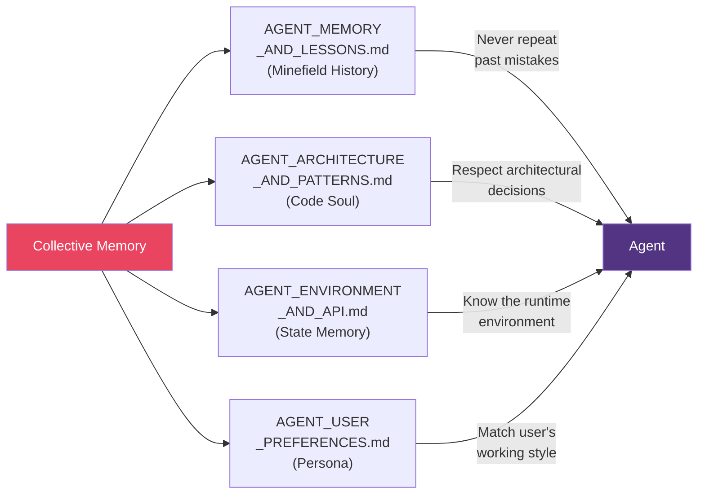
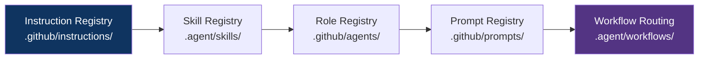

# Architecture Overview

Product: Agent Governance OS Starter Kit

This document provides a visual overview of the Universal Agent OS architecture, governance flow, and package structure.

---

## Governance Flow

---

## Collective Memory — Four Pillars

---

## Package Structure

```mermaid
graph TD
    Root["Universal Agent OS<br/>(Package Root)"] --> EN["en/<br/>English Locale Pack"]
    Root --> TR["tr/<br/>Turkish Locale Pack"]
    Root --> Skills["skills/<br/>Skill Library"]
    Root --> Agents["agents/<br/>Agent Definitions"]
    Root --> Docs["docs/<br/>Documentation"]
    Root --> Examples["examples/<br/>Reference Implementations"]
    Root --> Tests["tests/<br/>Governance Test Suite"]
    Root --> Init["init-agent-os.sh<br/>init-agent-os.ps1<br/>Bootstrap Scripts"]

    EN --> EN_Rules["AGENT_OS_RULES.md"]
    EN --> EN_Agents["AGENTS.md"]
    EN --> EN_Plan["AGENT_OS_PLAN_TEMPLATE.md"]
    EN --> EN_CM["Collective Memory<br/>Templates (4 files)"]
    EN --> EN_Adapters["Agent Adapters<br/>(CLAUDE/GEMINI/AIDER.md)"]
    EN --> EN_Native[".agent/ .codex/<br/>.github/ .cursor/<br/>Native Surfaces"]

    TR --> TR_Rules["AGENT_OS_RULES.md"]
    TR --> TR_Agents["AGENTS.md"]
    TR --> TR_Plan["AGENT_OS_PLAN_TEMPLATE.md"]
    TR --> TR_CM["Collective Memory<br/>Templates (4 files)"]

    style Root fill:#1a1a2e,color:#fff
    style EN fill:#16213e,color:#fff
    style TR fill:#16213e,color:#fff
```

---

## Phase-1 Auto-Activation Chain

The registries are loaded in this order. Each downstream registry depends on its upstream sources. When any domain map changes, all affected downstream registries, workflow entries, and documentation must be updated in the same change.

---

## Honesty Boundary

This package enforces an explicit honesty boundary:

- If a feature is **not implemented**, it is marked as `Planned`.
- If a gate was **not run**, it is marked as `NOT_RUN` — never `PASS`.
- If data is **simulated**, it is marked as `Simulated` — never `Verified`.
- The Evidence Manifest (`docs/EVIDENCE_MANIFEST_TEMPLATE.md`) formalizes this discipline.

This prevents the common failure mode where an agent claims completion without evidence.
